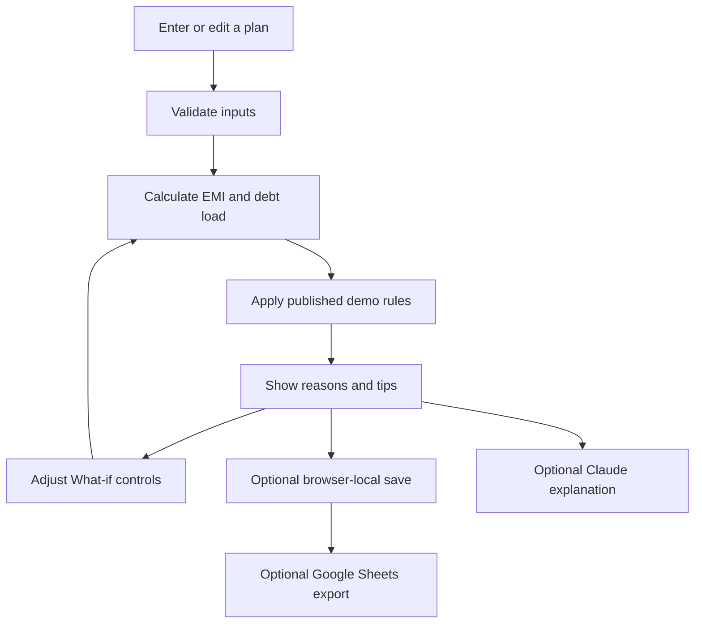
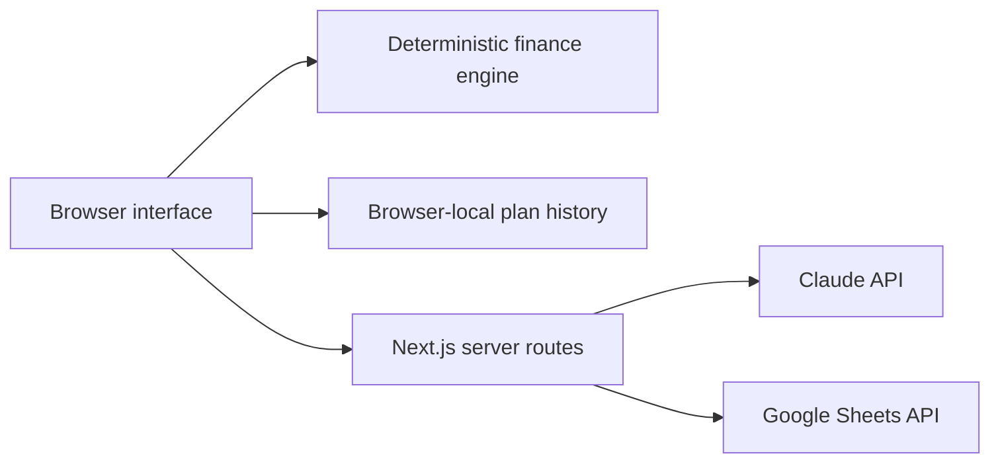

# LoanLens AI — Capstone Report

## Abstract
LoanLens AI is a web-based, educational BFSI simulator. It combines a transparent loan readiness estimate, user-provided credit score context, EMI amortization, and financial tips. Its What-if Lab compares a pinned plan against live changes. The app is built with Next.js for Vercel; optional server-side integrations support Claude explanations and Google Sheets export.

## Problem and objective
A monthly EMI by itself does not reveal total interest or the effect of existing debts. Users can compare borrowing paths and see the exact assumptions behind an illustrative readiness result. This system does not make credit decisions or submit loan applications.

## Modules

| Tool | Input | Output |
|---|---|---|
| Planner | Loan terms, income, existing EMIs, age, employment, experience, optional score | EMI, debt load, illustrative status and reasons |
| Credit context | Score copied by the user from their report | Educational band; no invented bureau score |
| EMI breakdown | Principal, annual rate, tenure | Interest, repayment, year-by-year principal and balance |
| Financial tips | Calculated plan | Deterministic guidance; optional Claude summary |
| What-if Lab | Adjusted amount, tenure and existing debt | Baseline/current comparison |
| Saved plans | User-chosen label and entered figures | Browser-local save, load and delete; optional sheet export |

## Workflow

## Architecture

## Formula and assumptions
For principal `P`, monthly rate `r = annual rate / 1200`, and `n` months, `EMI = P × r × (1+r)^n / ((1+r)^n − 1)`. At zero interest `EMI = P/n`. Total repayment is `EMI × n`; interest is total repayment minus principal. Debt load is `(existing EMIs + new EMI) / monthly income`.

The thresholds shown in the app are illustrative and configurable in `lib/finance.ts`, not bank underwriting policies. A user-provided score is never represented as an official score fetched by this application.

## Verification
The ₹5,00,000 / 12% / 36-month fixture yields about ₹16,607.15 per month. Zero-rate EMI, amortization balance, high debt-load outcomes, and invalid-input boundaries were checked. The Vercel-targeted Next.js production build and TypeScript check passed.

## Data and limitations
The Vercel variant saves plans only in the same browser. Clearing browser data removes them. Google Sheets export and Claude require account credentials and remain disabled until supplied. The public API endpoints need authentication and rate limits before paid services are enabled. Do not use this educational simulator to decide or offer credit.

## Future work
Add account-backed cross-device records with a retention/deletion policy, lender-provided rules, authorized credit bureau data, audited accessibility, and PDF comparisons.
